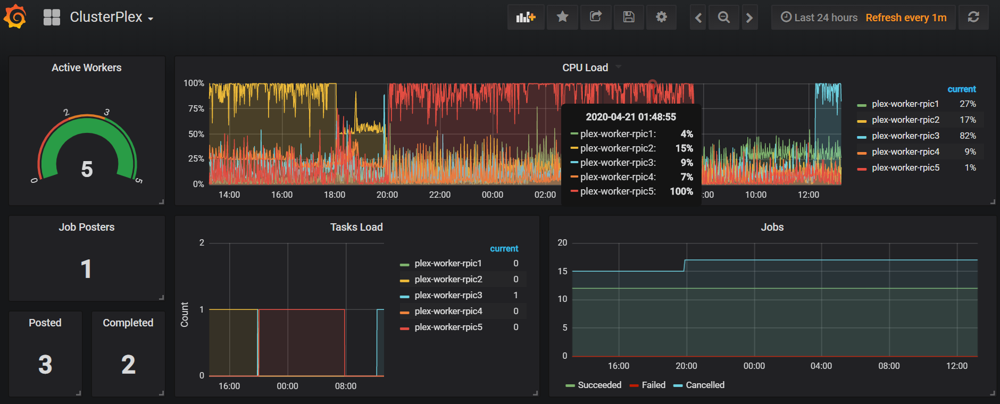

# ClusterPlex
[](https://github.com/pabloromeo/clusterplex/blob/master/LICENSE)
[](https://GitHub.com/pabloromeo/clusterplex/releases/)
[](https://github.com/pabloromeo/clusterplex/actions)

## What is it?

ClusterPlex is basically an extended version of Plex, which supports distributed Workers across a cluster to handle transcoding requests.

[Plex](https://plex.tv) organizes video, music and photos from personal media libraries and streams them to smart TVs, streaming boxes and mobile devices.


## How it works

In order to be able to use multiple nodes for transcoding, it's made up of 3 parts:

1. A custom Docker image based on the official linuxserver image, in which Plex’s own transcoder is renamed and a shim is put in its place which calls a small Node.js app that communicates with the Orchestrator container over websockets.

2. An Orchestrator (Node.js application which receives all transcoding requests from PMS and forwards it to one of the active Workers available over websockets.

3. Worker docker image based on the PMS image as well, with a Node.js app running on it, which receives requests from the Orchestrator and kicks off the transcoding and reports progress back. Workers can come online or go offline and the Orchestrator manages their registrations and availability. These Workers can run as replicated services managed by the cluster.

Upgrading Plex when a new version comes out is basically just rebuilding the docker images to get the latest update.

**Important:** Plex’s Application Data and transcoding folders should be ideally in shared storage over NFS, SMB, Gluster or similar and the Media Libraries should all be mounted as volumes both in PMS and each worker node under the same paths. The Worker will invoke the transcoder using the original path arguments so the content should be available to every worker as well. 

## Example Docker Swarm Deployment


Docker swarm stack example:

```
---
version: '3.4'

services:
  plex:
    image: ghcr.io/pabloromeo/clusterplex_pms:latest
    deploy:
      mode: replicated
      replicas: 1
    environment:
      VERSION: docker
      PUID: 1000
      PGID: 1000
      TZ: Europe/London
      ORCHESTRATOR_URL: http://plex-orchestrator:3500
      PMS_IP: 192.168.2.1
      TRANSCODE_OPERATING_MODE: both #(local|remote|both)
      TRANSCODER_VERBOSE: "1"   # 1=verbose, 0=silent
    healthcheck:
      test: curl -fsS http://localhost:32400/identity > /dev/null || exit 1
      interval: 15s
      timeout: 15s
      retries: 5
      start_period: 30s
    volumes:
      - /path/to/config:/config
      - /path/to/backups:/backups
      - /path/to/tv:/data/tv
      - /path/to/movies:/data/movies
      - /path/to/transcodedata:/transcode
      - /etc/localtime:/etc/localtime:ro
    ports:
      - 32469:32469
      - 32400:32400
      - 3005:3005
      - 8324:8324
      - 1900:1900/udp
      - 32410:32410/udp
      - 32412:32412/udp
      - 32413:32413/udp
      - 32414:32414/udp

  plex-orchestrator:
    image: ghcr.io/pabloromeo/clusterplex_orchestrator:latest
    deploy:
      mode: replicated
      replicas: 1
      update_config:
        order: start-first
    healthcheck:
      test: curl -fsS http://localhost:3500/health > /dev/null || exit 1
      interval: 15s
      timeout: 15s
      retries: 5
      start_period: 30s
    environment:
      TZ: Europe/London
      STREAM_SPLITTING: "OFF" # ON | OFF (default)
      LISTENING_PORT: 3500
      WORKER_SELECTION_STRATEGY: "LOAD_RANK" # RR | LOAD_CPU | LOAD_TASKS | LOAD_RANK (default)
    volumes:
      - /etc/localtime:/etc/localtime:ro
    ports:
      - 3500:3500

  plex-worker:
    image: ghcr.io/pabloromeo/clusterplex_worker:latest
    hostname: "plex-worker-{{.Node.Hostname}}"
    deploy:
      mode: global
      update_config:
        order: start-first
    environment:
      VERSION: docker
      PUID: 1000
      PGID: 1000
      TZ: Europe/London
      LISTENING_PORT: 3501      # used by the healthcheck
      STAT_CPU_INTERVAL: 2000   # interval for reporting worker load metrics
      ORCHESTRATOR_URL: http://plex-orchestrator:3500
    healthcheck:
      test: curl -fsS http://localhost:3501/health > /dev/null || exit 1
      interval: 15s
      timeout: 15s
      retries: 5
      start_period: 240s
    volumes:
      - /path/to/codecs:/codecs # (optional, can be used to share codecs)
      - /path/to/tv:/data/tv
      - /path/to/movies:/data/movies
      - /path/to/transcodedata:/transcode
      - /etc/localtime:/etc/localtime:ro

```

## Parameters

### Plex

The image extends the [LinuxServer Plex](https://hub.docker.com/r/linuxserver/plex/) Image, see [here](https://hub.docker.com/r/linuxserver/plex/) for information on all its parameters.

| Parameter | Function |
| :----: | --- |
| `ORCHESTRATOR_URL` | The url where the orchestrator service can be reached (ex: http://plex-orchestrator:3500) |
| `PMS_IP` | IP pointing at the Plex instance (can be the cluster IP) |
| `TRANSCODE_OPERATING_MODE` | "local" => only local transcoding (no workers), "remote" => only remote workers transcoding, "both" (default) => Remote first, local if it fails |
| `TRANSCODER_VERBOSE` | "0" (default) => info level, "1" => debug logging |

### Orchestrator

| Parameter | Function |
| :----: | --- |
| `TZ` | Timezone |
| `STREAM_SPLITTING` | Experimental feature, only "OFF" is allowed |
| `LISTENING_PORT` | Port where orchestrator should run |
| `WORKER_SELECTION_STRATEGY` | How the worker is chosen: "LOAD_CPU" => lowest CPU usage, "LOAD_TASKS" => least amount of current tasks, "RR" => round-robin, "LOAD_RANK" (default) => CPU benchmark * free_cpu |

#### Orchestrator metrics

The Orchestrator exposes usage metrics at */metrics*, in Prometheus format.

```
# HELP jobs_posted Jobs Posted
# TYPE jobs_posted counter
jobs_posted 0

# HELP jobs_completed Jobs Completed
# TYPE jobs_completed counter
jobs_completed 0

# HELP jobs_succeeded Jobs Succeeded
# TYPE jobs_succeeded counter
jobs_succeeded 0

# HELP jobs_failed Jobs Failed
# TYPE jobs_failed counter
jobs_failed 0

# HELP jobs_killed Jobs Killed
# TYPE jobs_killed counter
jobs_killed 0

# HELP job_posters_active Active Job Posters
# TYPE job_posters_active gauge
job_posters_active 0

# HELP workers_active Active Workers
# TYPE workers_active gauge
workers_active 2

# HELP worker_load_cpu Worker Load - CPU usage
# TYPE worker_load_cpu gauge
worker_load_cpu{worker_id="869902cf-5f95-49ec-8d4e-c49ff9bee914",worker_name="NODE1"} 28.13
worker_load_cpu{worker_id="61e06076-4b9e-4d83-bcaa-1385f2d8f414",worker_name="NODE2"} 11.97

# HELP worker_load_tasks Worker Load - Tasks Count
# TYPE worker_load_tasks gauge
worker_load_tasks{worker_id="869902cf-5f95-49ec-8d4e-c49ff9bee914",worker_name="NODE1"} 1
worker_load_tasks{worker_id="61e06076-4b9e-4d83-bcaa-1385f2d8f414",worker_name="NODE2"} 0
```

Using these metrics you can create Dashboards in something like Grafana, such as:



### Workers

The image extends the [LinuxServer Plex](https://hub.docker.com/r/linuxserver/plex/) Image, see [here](https://hub.docker.com/r/linuxserver/plex/) for information on all its parameters.

| Parameter | Function |
| :----: | --- |
| `LISTENING_PORT` | Port where workers expose the internal healthcheck |
| `STAT_CPU_INTERVAL` | Frequency at which the worker sends stats to the orchestrator (in ms). Default 2000 |
| `ORCHESTRATOR_URL` | The url where the orchestrator service can be reached (ex: http://plex-orchestrator:3500) |
| `TRANSCODER_PATH` | Default = '/usr/lib/plexmediaserver/' |
| `TRANSCODER_NAME` | Default = 'Plex Transcoder' |
